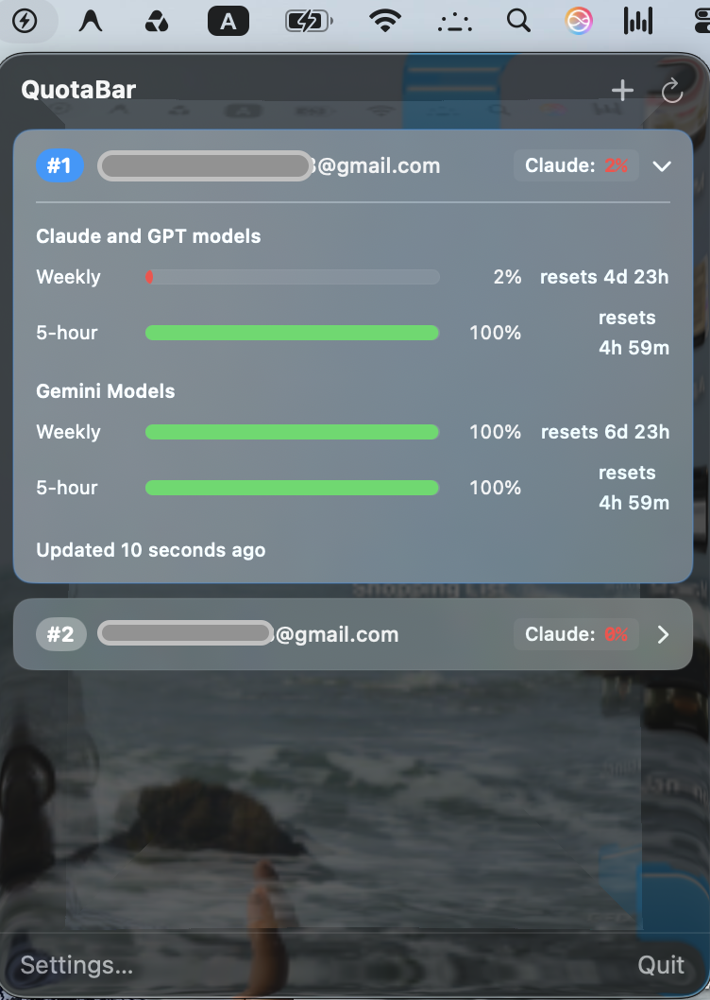
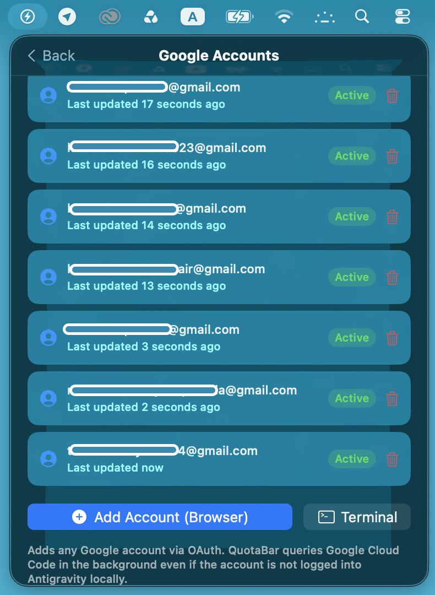
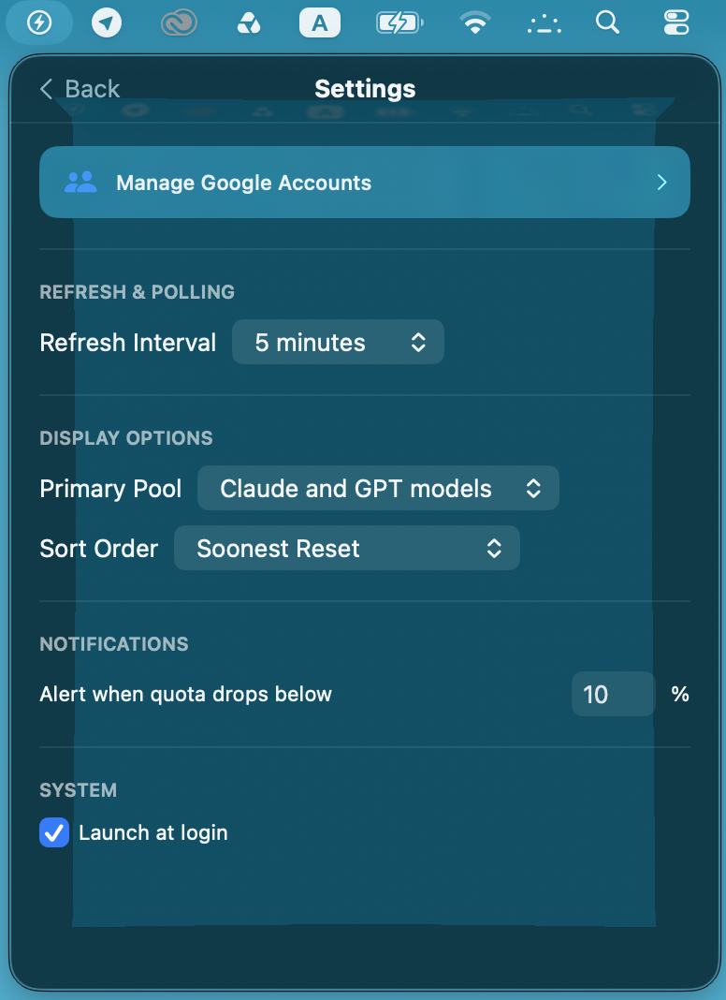
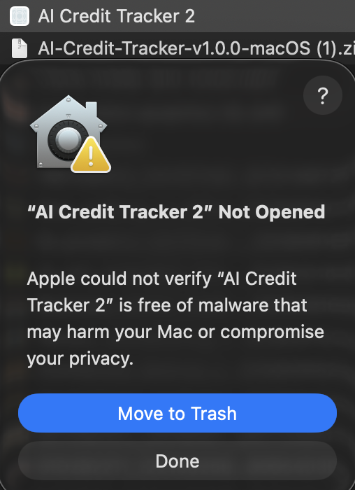
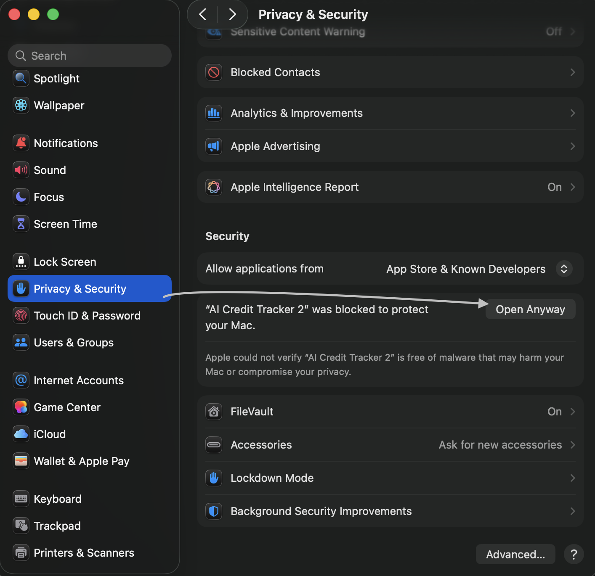

# AI Credit Tracker

> Track your Google AI Pro credits across multiple accounts from your macOS menu bar.
>
> *Never run out of AI credits again.*

<!-- Badges -->
[](https://github.com/KhaledTheDeveloper/ai-credit-tracker/releases/latest)
[](LICENSE)
[](https://www.apple.com/macos/)
[](https://swift.org)
[](https://nodejs.org)
[](CONTRIBUTING.md)

> **Disclaimer**: AI Credit Tracker is an independent, community-driven open-source project. It is **NOT** affiliated with, sponsored by, or endorsed by Google LLC, Alphabet Inc., or Anthropic PBC. "Google", "Gmail", "Gemini", and related marks are registered trademarks of Google LLC. "Claude" is a registered trademark of Anthropic PBC. See [DISCLAIMER.md](DISCLAIMER.md) for full details.

---

## What Is This?

AI Credit Tracker is a **native macOS menu bar app** that monitors your Google AI Pro subscription quotas in real time. If you have one or more Google accounts with AI Pro, this app shows you exactly how much credit you have left — across both **Gemini Models** and **Claude & GPT Models** — without needing to open any IDE or browser.

<p align="center">
  
  &nbsp;&nbsp;
  
  &nbsp;&nbsp;
  
</p>

### Why?

- Google AI Pro subscriptions have **two independent quota pools**: Gemini Models and Claude & GPT Models.
- Each pool has a **5-hour rolling window** and a **weekly cap**.
- When the weekly cap hits 0%, the 5-hour window is suspended until the weekly resets.
- If you use multiple Google accounts, there is no easy way to see which account has credits available **right now**.

AI Credit Tracker solves this by showing all your accounts at a glance, sorted by who has the most headroom.

---

## Features

- 🔄 **Real-time quota monitoring** — Live percentages and countdown timers for both 5-hour and weekly windows
- 👥 **Multi-account support** — Track unlimited Google accounts simultaneously
- 🏆 **Smart ranking** — Accounts are automatically sorted by available credits (most headroom first)
- 🃏 **Compact accordion cards** — Expandable `#1`, `#2`, `#3` cards with quick-glance quota capsules
- 🔔 **Notifications** — Get alerted when credits drop below your threshold or reset
- 🔒 **100% local & private** — Zero telemetry, zero analytics, zero third-party servers. See [SECURITY.md](SECURITY.md)
- 🌐 **Cross-platform engine** — The Node.js engine works on macOS, Windows, and Linux (native UI is macOS-only for now)

---

## Requirements

| Requirement | Version |
|-------------|---------|
| macOS | 13 (Ventura) or later |
| Swift | 5.9+ (included with Xcode 15+) |
| Node.js | 18+ |
| Google Account | With [Google AI Pro](https://ai.google.dev/) subscription |

## Install

### Terminal (recommended)

The fastest way — downloads, installs, and removes the macOS quarantine flag in one command:

```bash
curl -sL https://github.com/KhaledTheDeveloper/ai-credit-tracker/releases/latest/download/AI-Credit-Tracker-v1.0.2-macOS.zip -o /tmp/act.zip \
  && unzip -o /tmp/act.zip -d /Applications \
  && xattr -cr "/Applications/AI Credit Tracker.app" \
  && rm /tmp/act.zip \
  && open "/Applications/AI Credit Tracker.app"
```

> **Requires:** [Node.js 18+](https://nodejs.org) must be installed on your system.

### Direct Download

1. Grab the latest `.zip` from [**Releases**](https://github.com/KhaledTheDeveloper/ai-credit-tracker/releases/latest), unzip, and drag **AI Credit Tracker.app** to your Applications folder.

2. **First launch (unsigned build):** the current builds are ad-hoc signed (not yet notarized), so on first launch macOS shows *"AI Credit Tracker" Not Opened* and blocks it.

   To open it, go to **System Settings → Privacy & Security** and click **Open Anyway**, then **Open** in the confirmation dialog. (Or run `xattr -cr "/Applications/AI Credit Tracker.app"` in Terminal.)

   <p align="center">
     
     &nbsp;&nbsp;&nbsp;
     
   </p>

> After the first launch, macOS remembers your choice and the app opens normally from then on.

### Build from Source

If you prefer to compile it yourself (requires Xcode 15+ and Swift 5.9+):

```bash
git clone https://github.com/KhaledTheDeveloper/ai-credit-tracker.git
cd ai-credit-tracker
./scripts/build-app.sh
open "dist/AI Credit Tracker.app"
```

### Adding Your Google Accounts

The app discovers accounts from your local Gemini CLI / Antigravity IDE session automatically. To add additional accounts:

**Browser OAuth (recommended):** Click the **`+`** button in the menu bar → **"+ Add Account (Browser)"** → sign in with your Google account.

**Already use Gemini CLI or Antigravity IDE?** Accounts are automatically discovered — no extra setup needed.

---

## How It Works

```
┌─────────────────────────────────────────────────┐
│              macOS Menu Bar UI                   │
│         (SwiftUI · Sources/QuotaBar)             │
│                                                  │
│  #1 user@gmail.com          Claude: 45%  ▸       │
│  #2 work@gmail.com          Claude: 0%   ▸       │
│  #3 alt@gmail.com           Claude: 0%   ▸       │
└──────────────────────┬──────────────────────────┘
                       │ JSON over stdout
┌──────────────────────▼──────────────────────────┐
│           Engine Bridge (Node.js)                │
│            (engine/index.js)                     │
│                                                  │
│  • Discovers local OAuth tokens automatically    │
│  • Refreshes expired tokens via Google OAuth     │
│  • Queries Google quota API                      │
│  • Returns standardized JSON array               │
└──────────────────────┬──────────────────────────┘
                       │ HTTPS (user's own credentials)
┌──────────────────────▼──────────────────────────┐
│        Google Cloud Code API                     │
│  googleapis.com/v1internal:retrieveUserQuota...  │
└─────────────────────────────────────────────────┘
```

See [ARCHITECTURE.md](ARCHITECTURE.md) for the full technical deep-dive, including the engine JSON contract and cross-platform token discovery paths.

---

## Configuration

Click **"Settings…"** in the menu bar footer to configure:

| Setting | Default | Description |
|---------|---------|-------------|
| Refresh Interval | 15 minutes | How often to poll for updated quotas |
| Primary Pool | Claude and GPT models | Which pool drives ranking and notifications |
| Sort Order | Soonest Reset | How accounts are ranked (`Soonest Reset`, `Most Remaining`, `Alphabetical`) |
| Alert Threshold | 10% | Notify when credits drop below this percentage |
| Launch at Login | Off | Start AI Credit Tracker when you log in |

---

## Contributing

We welcome contributions! Whether you're fixing bugs, improving documentation, or building the **Windows or Linux version**, check out [CONTRIBUTING.md](CONTRIBUTING.md) for guidelines.

### Wanted: Windows & Linux Contributors! 🖥️🐧

The Node.js engine (`engine/index.js`) already works cross-platform. We need help building native system tray UIs for:

- **Windows** — WinUI 3, WPF (.NET 8), or Tauri
- **Linux** — AppIndicator, GTK, or Tauri

See [ARCHITECTURE.md](ARCHITECTURE.md) for the engine JSON contract and integration blueprint.

---

## Security & Privacy

- **Zero telemetry** — No data is ever sent to any server besides Google's own API endpoints.
- **Zero analytics** — No tracking, no metrics collection, no crash reporting.
- **Local-only storage** — Credentials are stored in your OS-protected user directories.
- **Read-only** — This tool only *reads* quota information. It never modifies anything.

See [SECURITY.md](SECURITY.md) for the full security model and vulnerability disclosure policy.

---

## FAQ

**Q: Do I need Antigravity or Gemini CLI installed?**
No. You can add accounts directly through the app's browser-based OAuth flow. Antigravity/Gemini CLI accounts are auto-discovered as a convenience, but they are not required.

**Q: Is this an official Google product?**
No. This is an independent open-source project. See [DISCLAIMER.md](DISCLAIMER.md).

**Q: What happens if Google changes or blocks the API?**
The tool uses an internal Google API endpoint that could change at any time. If that happens, we'll update the engine. See the [API Notice in DISCLAIMER.md](DISCLAIMER.md) for details.

**Q: Can I use my own OAuth client ID?**
Yes. Set the `ANTIGRAVITY_OAUTH_CLIENT_ID` and `ANTIGRAVITY_OAUTH_CLIENT_SECRET` environment variables before running.

**Q: Does this work on Windows or Linux?**
The engine (`node engine/index.js`) works on all platforms. The menu bar UI is macOS-only for now. We're looking for contributors to build Windows and Linux UIs — see [CONTRIBUTING.md](CONTRIBUTING.md).

---

## Changelog

### v1.0.2 — September 2026

- 🔄 **One-click account switching** — When quota runs out, switch Antigravity's active session to another account directly from the menu bar with a single click
- 🔑 **Full Antigravity OAuth scopes** — New logins now request the complete Antigravity scope set, so switched accounts work seamlessly with Antigravity IDE and CLI

### v1.0.1 — September 2026

- 🔧 **Launch at Login now works** — Previously the toggle was cosmetic; now it actually registers the app with macOS Login Items using `SMAppService`
- 🔔 **Notifications are live** — Low-quota alerts and reset notifications were never connected; now they fire as real macOS notifications when any pool drops below your configured threshold
- 🔄 **Standalone token refresh** — The app no longer requires Antigravity or Gemini CLI to be open; expired OAuth tokens are refreshed automatically in the background
- 💾 **Token persistence fix** — Refreshed tokens are now saved back to disk correctly, preventing repeated "offline" states after a cold boot
- 🛡️ **Ad-hoc code signing** — Downloaded `.app` now shows the friendly "Not Opened" Gatekeeper warning instead of the harsh "is damaged" error; bypass via Privacy & Security → Open Anyway
- 📥 **One-line terminal install** — New `curl` one-liner in README that downloads, installs, strips quarantine, and launches in one command
- ✅ **CI fix** — GitHub Actions now runs on `macos-15` with Xcode 16 so all 57 tests pass in CI

### v1.0.0 — September 2026

- 🎉 Initial release
- Real-time quota monitoring for Gemini Models and Claude & GPT Models
- Multi-account support with smart ranking
- Browser-based OAuth login (no CLI required)
- Compact accordion cards with expandable quota details
- Configurable poll interval, sort mode, and notification threshold
- 100% local and private — zero telemetry

---

## License

[MIT](LICENSE) © Khaled Mahmud
